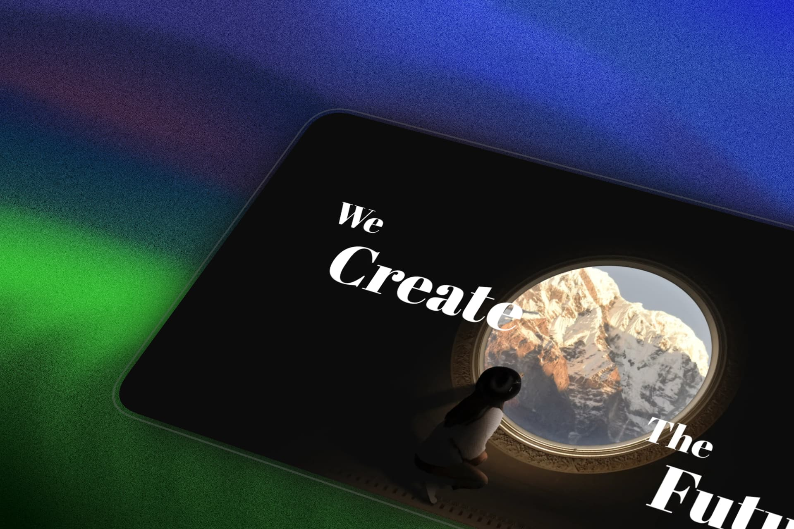

# 🖱️ Parallax Depth Scroll Animation ✨

An interactive web project demonstrating smooth scroll animations and deep parallax effects. This project leverages GSAP and its ScrollTrigger plugin to create an immersive, dynamic user experience as the user scrolls down the page.

## 🌌 Overview

This project showcases how to manipulate scaling and transform origins of visual elements based on the scroll position. It features a pinned container that "scrubs" through an animation timeline, giving the illusion of diving deep into the image and layout.

## 🚀 Technologies Used

- **HTML5** & **CSS3**: For structuring and styling the layout with modern web standards.
- **JavaScript (Vanilla)**: For the interactive logic.
- **GSAP (GreenSock Animation Platform)**: The core animation engine used for high-performance transitions.
- **ScrollTrigger**: A GSAP plugin specifically used to link animations to the user's scroll position.

## 💻 Features

- **Pinned Scroll Sections:** The main wrapper is pinned in place while the animation unfolds, preventing normal scrolling until the timeline completes.
- **Scroll Scrubbing:** The animation progress is directly tied to the scrollbar, allowing users to play the animation forward or backward smoothly simply by scrolling.
- **Depth Illusion:** Uses dynamic scaling (`scale: 2`) and CSS transformations (`transformOrigin: "center center"`) to create a 3D-like depth effect.

## 🛠️ How to Run Locally

1. Clone this repository to your local machine.
2. Open the `index.html` file in any modern web browser.
3. Scroll down to see the animation in action!

*Note: No build steps or local servers are strictly required.*
